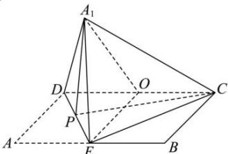

> [!faq]- 全练一本通解析
> **【答案】** A
>
> **【解析】**
> 解析：
> 
> 当平面 $A_{1}DE \perp$ 平面 CDE 时，三棱锥 $A_{1}-CDE$ 的体积取得最大值，因为 AB=2AD=2a, E 是 AB 的中点，所以 $A_{1}D=A_{1}E=a, DE=\sqrt{2}a, A_{1}D^{2}+A_{1}E^{2}=DE^{2}$ 所以 $\triangle A_{1}ED$ 为等腰直角三角形，因此取 DE 的中点 P，连接 $A_{1}P$ ，则 $A_{1}P \perp DE, A_{1}P=\frac{\sqrt{2}a}{2}$ 因为平面 $A_{1}DE \perp$ 平面 CDE，且平面 $A_{1}DE \cap$ 平面 CDE=DE，所以 $DE \perp$ 平面 CDE，
> 又 PC ⊂ 平面 CDE，所以 $DE \perp PC$ ，
> 又因为 $ED^{2}+CE^{2}=DC^{2}$ ，所以 $\triangle CED$ 为等腰直角三角形，因为 $EC=DE=\sqrt{2a}$ ，
> 所以 $PE=\frac{\sqrt{2}a}{2}$ ，故 $PC=\frac{\sqrt{10}a}{2}$ ，所以 $A_{1}P^{2}+CP^{2}=A_{1}C^{2}=3a^{2}$ ，
> 又由 $A_{1}D^{2}+A_{1}C^{2}=CD^{2}$ ，所以 $\triangle A_{1}CD$ 为直角三角形，且 $\angle DA_{1}C=\frac{\pi}{2}$ ，取 DC 的中点 O，连接 OE, $OA_{1}$ ，则有 OE=OA\_{1}=OC=OD，即 O 外接的球心，则 OE, $OA_{1}, OC, OD$ 为球半径，所以 $16\pi=4\pi\times a^{2}$ ，即 a=2。
>
> 故选 **A**.
