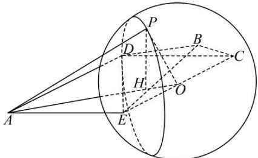

> [!faq]- 全练一本通解析
> **【答案】** D
>
> **【解析】**
> 解析:由题意可知, $\triangle CDE,\triangle BCE$ 均为等腰直角三角形,所以四面体B-ECD的外接球的球心O在EC的中点,
> 因为P是球O上的动点,若直线AO与直线AP所成角的最大,则AP与球O相切, $\angle APO=90^{\circ}$ ,此时, $\angle PAO$ 最大,
> 因为 $OP=\frac{1}{2}EC=\sqrt{2}$ , $AO=\sqrt{4+2-2\times2\times\sqrt{2}\times\left(-\frac{\sqrt{2}}{2}\right)}=\sqrt{10}$ ,所以 $\sin\angle PAO=\frac{\sqrt{5}}{5}$ 过 P 作 $PH \perp AO$ 垂足为 H，则 P 在以 H 为圆心，PH 为半径的圆上运动.
> 所以当 $PH \perp$ 平面 ADE 时四面体 P-AEC 的体积取得最大值.
> 因为 $AP = 2\sqrt{2}$ ，所以 $PH = 2\sqrt{2} \times \frac{\sqrt{5}}{5} = \frac{2\sqrt{10}}{5}$ ,
> 所以 $V_{P-ADE}=\frac{1}{3}\cdot h\cdot S_{\triangle ACE}=\frac{1}{3}\times\frac{2\sqrt{10}}{5}\times\frac{1}{2}\times2\times2=\frac{4\sqrt{10}}{15}$ ，故选:D.
> 
