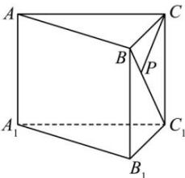

<!-- question-source:start -->
【29】如图, 三棱柱 $ABC - A_1B_1C_1$ 中, $AA_1 \perp$ 底面 $ABC$ , $\angle ACB = 90^\circ$ , $AC = 6$ , $BC = CC_1 = \sqrt{2}$ , $P$ 是 $BC_1$ 上一动点, 则 $CP + PA_1$ 的最小值是 \_\_\_\_.

<!-- question-source:end -->

![[Q00006193A1]]
