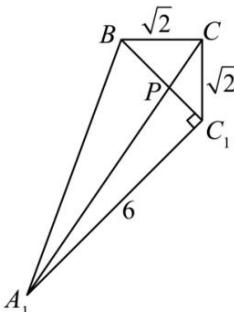

> [!faq]- 全练一本通解析
> **【答案】** $5\sqrt{2}$
>
> **【解析】**
> 把平面 $A_{1}C_{1}B$ 沿着 $BC_{1}$ 展开与 $\triangle CBC_{1}$ 在同一平面上，连接 $A_{1}C$ ，则 $CP + PA_{1}$ 的最小值是 $A_{1}C$
> 
> 因为 $\angle ACB = 90^{\circ}$ ，三棱柱 $ABC - A_{1}B_{1}C_{1}$ 是直三棱柱， $AC = 6, BC = C_{1}C = \sqrt{2}$ ， $A_{1}B = \sqrt{A_{1}B_{1}^{2} + B_{1}B^{2}} = \sqrt{A_{1}C_{1}^{2} + B_{1}C_{1}^{2} + B_{1}B^{2}} = \sqrt{36 + 2 + 2} = 2\sqrt{10}$ ， $BC_{1} = \sqrt{B_{1}B^{2} + B_{1}C_{1}^{2}} = \sqrt{2 + 2} = 2$ ，因为 $A_{1}C_{1}^{2} + BC_{1}^{2} = A_{1}B^{2}$ ，所以 $A_{1}C_{1} \perp BC_{1}$ 所以 $\angle A_{1}C_{1}B = 90^{\circ}, A_{1}C_{1} = 6$ 所以 $\angle CC_{1}A_{1} = 45^{\circ} + 90^{\circ} = 135^{\circ}$ ，由余弦定理得 $A_{1}C^{2} = A_{1}C_{1}^{2} + CC_{1}^{2} - 2A_{1}C_{1} \cdot CC_{1}\cos 135^{\circ} = 50$ ，所以 $A_{1}C = 5\sqrt{2}$ ，故 $CP + PA_{1}$ 的最小值是 $5\sqrt{2}$ .故答案为： $5\sqrt{2}$
