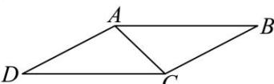

<!-- question-source:start -->
【34】（2024·湖北恩施高二上期末）在 □ABCD 中，∠DAC = 90°, AB = 2, BC = √3，将△ABC 沿 AC 翻折，使 BD = √5，则平面 BAC 与平面 DAC 夹角的余弦值是（）

A. $\frac{\sqrt{3}}{5}$ B. $\frac{\sqrt{2}}{4}$ C. $\frac{1}{3}$ D. $\frac{1}{2}$
<!-- question-source:end -->

![[Q00006198A1]]
