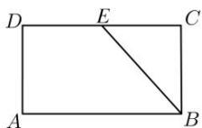
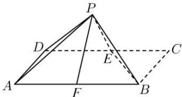

<!-- question-source:start -->
【35】（2022·山西长治高一下期末）在矩形ABCD中， $AB = 2BC = 2$ ， $E$ 是 $CD$ 的中点，将 $\triangle BCE$ 沿BE翻折，当 $\triangle BCE$ 翻折到 $\triangle PBE$ 的位置时，连接AP，DP,如图所示，设 $AB$ 的中点为 $F$ ，当 $PF = \frac{1}{2}$ 时，二面角 $A - BE - P$ 的余弦值为（）

A. $\frac{1}{3}$ B. $\frac{2}{3}$ C. $\frac{3}{4}$ D. $\frac{3}{5}$
<!-- question-source:end -->

![[Q00006199A1]]
