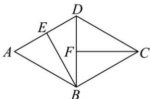
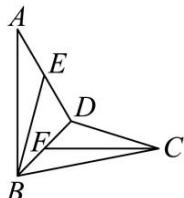

<!-- question-source:start -->
【36】（2021·浙江杭州高二上期中）如图，在菱形ABCD中， $\angle BAD=60^{\circ}$ ，线段AD，BD的中点分别为E,F。现将 $\triangle ABD$ 沿对角线BD翻折，则异面直线BE与CF所成角的取值范围（）

A. $\left(\frac{\pi}{6},\frac{\pi}{3}\right)$ B. $\left(\frac{\pi}{6},\frac{\pi}{2}\right]$ C. $\left(\frac{\pi}{3},\frac{\pi}{2}\right]$ D. $\left(\frac{\pi}{3},\frac{2\pi}{3}\right)$
<!-- question-source:end -->

![[Q00006200A1]]
