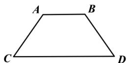

<!-- question-source:start -->
【37】如图, 已知梯形 ABDC, AB = AC = BD = 2, CD = 4, 沿着对角线 AD 折叠使得点 B, 点 C 的距离为 $2\sqrt{2}$ , 此时二面角 B - AD - C 的平面角为（）

A. $\frac{\pi}{6}$ B. $\frac{\pi}{4}$ C. $\frac{\pi}{3}$ D. $\frac{\pi}{2}$
<!-- question-source:end -->

![[Q00006201A1]]
