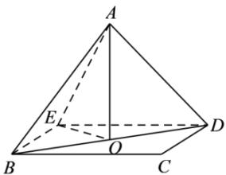

> [!faq]- 全练一本通解析
> **【答案】** C
>
> **【解析】**
> 解析: 过 B、D 作 BE // CD、DE // CB，且 BE, DE 交于 E，连接 AE、OE，
> 所以直线 AB 与 CD 所成角即为 $\angle ABE$ 或其补角，
> 
> 若正方形 $ABCD$ 边长为2，则 $BE = AB = AD = 2$ ，而 $AO \perp BD$ ，面 $ABD \perp$ 面 $BCD$ ， $AO \subset$ 面 $ABD$ ，面 $ABD \cap$ 面 $BCD = BD$ ，所以 $AO \perp$ 面 $BCD$ ，而 $OE \subset$ 面 $BCD$ ，即 $AO \perp OE$ ，且 $AO = OE = \sqrt{2}$ ，故 $AE = 2$ ，则 $\triangle ABE$ 为等边三角形，故 $\angle ABE = 60^\circ$ 。
>
> 故选 **C**
