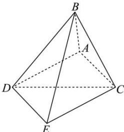

> [!faq]- 全练一本通解析
> **【答案】** C
>
> **【解析】**
> 解析：平移 $AD$ 使 $A$ 与 $C$ 重合，记平移后 $D$ 所在的点为点 $E$ ，
> 
> 此时 $AC \perp CE, AC \perp CB, AC = \sqrt{AB^{2} - BC^{2}} = 1$ 则 $\angle BCE$ 的余弦值即为平面 BAC 与平面 DAC 夹角的余弦值，
> 由已知 $CE = AD = BC = \sqrt{3}, BC = \sqrt{3}$ 在直角三角形 DBE 中， $BE=\sqrt{BD^{2}-DE^{2}}=\sqrt{BD^{2}-AC^{2}}=2$ 所以 $\cos\angle BCE=\frac{BC^{2}+EC^{2}-BE^{2}}{2\cdot BC\cdot CE}=\frac{3+3-4}{2\times\sqrt{3}\times\sqrt{3}}=\frac{1}{3}$ ，
>
> 故选 **C**.
