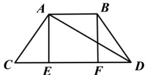
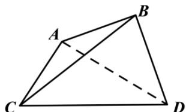

> [!faq]- 全练一本通解析
> **【答案】** D
>
> **【解析】**
> $$
> c D \text { 于 } E, F
> $$
> $$
> \mathrm{示}:
> $$
> 
> 因为 AB = AC = BD = 2, CD = 4，所以梯形 ABDC 为等腰梯形，则 EF = 2, CE = FD = 1.
> 在 $RT \triangle ACE$ 中，CE = 1, AC = 2，则 $\angle ACE = \frac{\pi}{3}$ .
> 所以 $AD = \sqrt{2^{2} + 4^{2} - 2 \times 2 \times 4 \times \frac{1}{2}} = 2\sqrt{3}$ 则 $AC^{2} + AD^{2} = CD^{2}$ ，即 $AC \perp AD$ 。
> 沿着对角线 AD 折叠使得点 B，点 C 的距离为 $2\sqrt{2}$ ，如图所示：
> 
> $$
> \triangle A B C
> $$
> $$
> A C = A B = 2, B C = 2 \sqrt {2}
> $$
> 则 $AC^{2} + AB^{2} = BC^{2}$ ，即 $AC \perp AB$ .
> 所以 $\left\{\begin{aligned}&AC\perp AB\\&AC\perp AD\\&AB\cap AD=A\end{aligned}\right.\Rightarrow AC\perp$ 平面 ABD.
> 又因为 $AC \subset$ 平面 ACD，所以平面 $ACD \perp$ 平面 ABD，
> 即二面角 B - AD - C 的平面角为 $\frac{\pi}{2}$ .
>
> 故选 **D**
