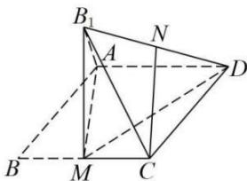

<!-- question-source:start -->
【47】（2023·全国高二专题）（多选）如图, 在菱形ABCD中, AB=2, $\angle ABC=\frac{\pi}{3}$ , M为BC的中点, 将 $\triangle ABM$ 沿直线AM翻折到 $\triangle AB_{1}M$ 的位置, 连接 $B_{1}C$ 和 $B_{1}D$ , N为 $B_{1}D$ 的中点, 在翻折过程中, 则下列结论中正确的是（）

A. 始终有 $AM \perp B_{1}C$ B. 线段 CN 的长为定值
C. 直线 $AB_{1}$ 和 CN 所成的角始终为 $\frac{\pi}{6}$ D. 当三棱锥 $B_{1}-AMD$ 的体积最大时, 其外接球的表面积是 $8\pi$
<!-- question-source:end -->

![[Q00006211A1]]
