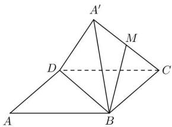

<!-- question-source:start -->
【48】（2024·全国高三专题）（多选）如图，在菱形ABCD中， $AB=2,\angle BAD=\frac{\pi}{3}$ ，将 $\triangle ABD$ 沿BD折起，使A到 $A'$ ，且点 $A'$ 不落在底面BCD内，若点M为线段 $A'C$ 的中点，则在 $\triangle ABD$ 翻折过程中，以下命题中正确的是（）

A. 四面体 $A' - BCD$ 的体积的最大值为 1
B. 存在某一位置, 使得 $BM \perp CD$ C. 异面直线 $BM$ 与 $A'D$ 所成的角为定值
D. 当二面角 $A' - BD - C$ 的余弦值为 $\frac{1}{3}$ 时, $A'C = 2$
<!-- question-source:end -->

![[Q00006212A1]]
