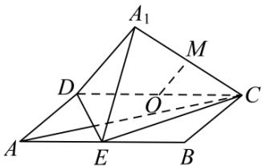

> [!faq]- 全练一本通解析
> **【答案】** D
>
> **【解析】**
> 解析: 对①: 假设 $AC \perp$ 平面 $A_{1}DE$ , $DE \subset$ 平面 $A_{1}DE$ , 则 $AC \perp DE$ , 则 $\angle DEA = 45^{\circ}$ , $\tan \angle CAB = \frac{1}{2} \neq 1$ , 故 AC, DE 不垂直, 假设不成立, ①错误;
> 
> 对②: 取 CD 中点 O，连接 OM，M 为线段 $A_{1}C$ 的中点，则 $OM=\frac{1}{2}DA_{1}=\frac{1}{2}DA$ ，则 M 在以 O 为球心，半径为 $\frac{1}{2}DA$ 的球上，②正确；
>
> 故选 **D**
