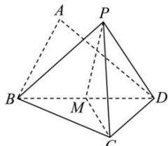

> [!faq]- 全练一本通解析
> **【答案】** C
>
> **【解析】**
> 解析:如图所示,取 BD 的中点 M , 连接 PM, CM
> 
> $\triangle BCD$ 是以 $BD$ 为斜边的等腰直角三角形, $\therefore BD \perp CM$ $\triangle ABD$ 为等边三角形, $\therefore BD \perp PM$
> $\therefore BD \perp$ 面 $PMC$ ， $\therefore BD \perp PC$ ，故 A 正确
> 对于 B, 假设 $DP \perp BC$ ，又 $BC \perp CD$ $\therefore BC \perp$ 面 $PCD$ ， $\therefore BC \perp PC$ ，
> 又 $PB = 2, BC = \sqrt{2}$ ， $PC = \sqrt{2} \in \left[\sqrt{3} - 1, \sqrt{3} + 1\right]$ ，故 DP 与 BC 可能垂直，故 B 正确
> 当面 $PBD \perp$ 面 $BCD$ 时，此时 $PM \perp$ 面 $BCD$ ， $\angle PDB$ 即为直线 DP 与平面 $BCD$ 所成角
> 此时 $\angle PDB = 60^\circ$ ，故 C 错误
> 当面 $PBD \perp$ 面 $BCD$ 时，此时四面体 $PBCD$ 的体积最大，此时的体积为： $V = \frac{1}{3} S_{\triangle BCD} \cdot PM = \frac{1}{3} \times (\frac{1}{2} \times \sqrt{2} \times \sqrt{2}) \times \sqrt{3} = \frac{\sqrt{3}}{3}$ ，故 D 正确
>
> 故选 **C**
