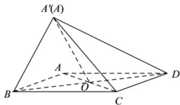

> [!faq]- 全练一本通解析
> **【答案】** C
>
> **【解析】**
> 解析：在矩形 $ABCD$ 中，设 $AB = m$ 、 $AD = n$ ，连接 $AC$ 交 $BD$ 于点 $O$ ，翻折后 $AO + CO = \sqrt{m^2 + n^2} > AC$ ，
> 
> $\cos \angle ADC = \frac{AD^2 + CD^2 - AC^2}{2\times AD\times CD} = \frac{m^2 + n^2 - AC^2}{2mn} >0$ $\therefore \angle ADC$ 一定为锐角，A成立，
> 当 $m = n$ 时， $BD\bot AO$ 、 $BD\bot CO$ ， $AO\cap CO = O$ $\therefore BD\bot$ 平面 $AOC$ ，又 $AC\subset$ 平面 $AOC$ $\therefore AC\bot BD$ ，B成立，
> 若 $CD\bot$ 平面 $ABD$ ， $BD\subset$ 平面 $ABD$ ，则 $CD\bot BD$ 所以 $\angle BCD$ 为直角，与 $CD$ 与 $BD$ 一定不垂直矛盾，C不成立， $\because AO = BO = CO = DO$ $\therefore$ 点 $O$ 为三棱锥 $A - BCD$ 外接球的球心，外接球的直径为 $\sqrt{m^2 + n^2}$ $\therefore$ 在翻折过程中外接球的体积不变，D成立.
>
> 故选 **C**.
