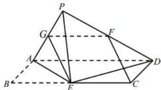

> [!faq]- 全练一本通解析
> **【答案】** C
>
> **【解析】**
> 解析:对于 A:如图,取 AP 中点 G,连结 EG、FG,又因为点 F 为线段 PD 的中点,所以 FG//AD 且 $FG=\frac{1}{2}AD$ ,因为 CE//AD 且 $CE=\frac{1}{2}AD$ ,可得 CE//GF 且 CE=GF,
> 所以四边形 CEGF 是平行四边形,所以 CF // EG,CF = EG,因为 CF ∉ 面 AEP,EG ⊂ 面 AEP,所以 CF // 平面 AEP;故选项 A 正确;
> 对于 B: 因为 CF // EG, 所以 $\angle PEG$ 即为直线 CF 与 PE 所成角, 在等腰直角 $\triangle AEP$ 中, EG 为直角边 AP 上的中线, 所以 $\angle PEG$ 是定值, 故选项 B 正确;
> 对于 C: 设 AD = 2，则 AB = BE = 1，可得 DE = AE = $\sqrt{2}$ ，可得 $AE^{2} + ED^{2} = AD^{2}$ ，所以 $AE \perp ED$ ，若 $AE \perp DP$ ， $ED \cap DP = D$ ，可得 $AE \perp$ 面 DEP，因为 $PE \subset$ 面 DEP，
> 所以 $AE \perp EP$ ，即 $\angle AEP = 90^{\circ}$ ，与 $\angle APE = 90^{\circ}$ 矛盾，所以 $AE \perp DP$ 不成立，故选项 C 不正确；
> 对于 D:由已知得 $AE \perp DE$ ，当面 $APE \perp$ 面 AECD 时，因为面 $APE \cap$ 面 AECD = AE， $DE \subset$ 面 AECD，所以 $DE \perp$ 平面 APE，因为 $AP \subset$ 平面 APE，可得 $DE \perp AP$ 又因为 $AP \perp PE$ , $DE \cap PE = E$ , 所以 AP⊥平面 PDE,
> 故 $\angle PDA$ 为 AD 与平面 PDE 所成角，在 Rt△APD 中，因为
> AD = 2AB = 2PA,
> 可得 $\angle PDA = 30^{\circ}$ ，故选项 D 正确；故选：C.
> 
