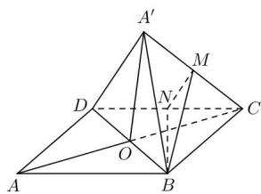

> [!faq]- 全练一本通解析
> **【答案】** ABD
>
> **【解析】**
> 解析: 连接 AC 交 BD 于 O, 连接 $OA'$ , 取 CD 的中点 N, 连接 MN, BN,
> 对于 A, 当平面 $A^{\prime}BD \perp$ 平面 BCD 时, 四面体 $A^{\prime}-BCD$ 的体积最大,
> 点 $A'$ 到平面 BCD 的距离最大,
> 此时在菱形 ABCD 中，AB = 2， $\angle BAD = \frac{\pi}{3}$ ，
> 则 $\triangle ABD, \triangle BCD$ 都是等边三角形，
> 则 $OA' = OA = OC = \sqrt{3}$ ，
> 此时四面体 $A' - BCD$ 的体积为 $\frac{1}{3} \times \frac{1}{2} \times 2 \times \sqrt{3} \times \sqrt{3} = 1$ ,
> 所以四面体 $A' - BCD$ 的体积的最大值为 1, 故 A 正确;
> 对于 B, 因为 M, N 分别为 $A'C$ , CD 的中点,
> 所以 $BN \perp CD$
> $MN \parallel A'D$ 且 $MN = \frac{1}{2}A'D = 1$ ,
> 由题意 $\angle A^{\prime}DC\in\left(0,\frac{2\pi}{3}\right)$ ，则 $\angle MNC\in\left(0,\frac{2\pi}{3}\right)$ ,
> 当 $\angle MNC=\frac{\pi}{2}$ 时， $MN\perp CD$
> 因为 $MN \cap BN = N$ ，MN, BN ⊂ 平面 BMN
> 所以 $\angle MNC = \frac{\pi}{2}$ 时， $CD\perp$ 平面BMN
> 又 $BM \subset$ 平面 $BMN$ ，
> 所以 $CD \perp BM$
> 所以存在某一位置, 使得 $BM \perp CD$ , 故 B 正确;
> 对于 C, 因为 $MN \parallel A'D$ ,
> 所以异面直线 BM， $A'D$ 所成的角即为 $\angle BMN$ 或其补角，
> $$
> \cos \angle B M N = \frac {1 + B M ^ {2} - 3}{2 B M} = \frac {B M}{2} - \frac {1}{B M},
> $$
> 因为 BM 不为定值, 所以 $\cos\angle BMN$ 不为定值,
> 即异面直线 BM， $A^{\prime}D$ 所成的角不为定值，故 C 错误；
> 对于 D, 因为 $OC \perp BD, OA' \perp BD$
> 所以 $\angle A^{\prime}OC$ 即为二面角 $A^{\prime} - BD - C$ 的平面角，
> 则 $\cos \angle A'OC = \frac{3 + 3 - A'C^2}{2\times\sqrt{3}\times\sqrt{3}} = \frac{6 - A'C^2}{6} = \frac{1}{3}$ ，所以 $A^{\prime}C = 2$ ，故D正确.
> 故选:ABD.
> 
