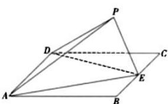

<!-- question-source:start -->
【4】如图, 在矩形 ABCD 中, $AB = \sqrt{2}$ , BC = 2, E 为 BC 中点, 把 $\triangle ABE$ 和 $\triangle CDE$ 分别沿 AE, DE 折起, 使点 B 与点 C 重合于点 P, 若三棱锥 P - ADE 的四个顶点都在球 O 的球面上, 则球 O 的表面积为()

A. $3\pi$ B. $4\pi$ C. $5\pi$ D. $9\pi$
<!-- question-source:end -->

![[Q00006240A1]]
