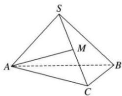

<!-- question-source:start -->
【5】（2024·云南高三下阶段练习）如图, 在正三棱锥 S-ABC 中, 点 M 是 SC 的中点, 且 $AM \perp SB$ , 底面边长 $AB = 2\sqrt{2}$ , 则正三棱锥 S-ABC 的外接球的表面积为 \_\_\_\_.

第十三节 专题: 几何体的外接球与内切球问题
<!-- question-source:end -->

![[Q00008934A1]]
