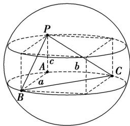
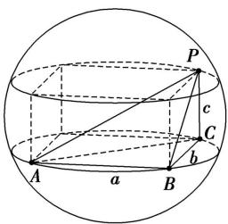
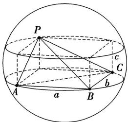
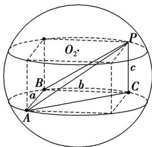

模型 1: 墙角模型

图1

图2

图3

图4

墙角模型是三棱锥有一条侧棱垂直于底面且底面是直角三角形模型, 用补形法（构造长方体或正方体）解决. 外接球的直径等于长方体的体对角线长.
使用范围: 3 组或 3 条棱两两垂直; 或可在长方体中画出该图且各顶点与长方体的顶点重合
推导过程: 长方体的体对角线就是外接球的直径
公式: 找三条两两垂直的线段, 直接用公式 $(2R)^{2}=a^{2}+b^{2}+c^{2}$ , 即 $2R=\sqrt{a^{2}+b^{2}+c^{2}}$ , 求出 R.

![[高中/课堂同步/题库/高中数学全练一本通/立体几何初步/第十三节 专题-几何体的外接球与内切球问题/题型 1_ 求结合体的外接球/模型 1_ 墙角模型/questions/Q00006237.md]]
![[高中/课堂同步/题库/高中数学全练一本通/立体几何初步/第十三节 专题-几何体的外接球与内切球问题/题型 1_ 求结合体的外接球/模型 1_ 墙角模型/questions/Q00006238.md]]
![[高中/课堂同步/题库/高中数学全练一本通/立体几何初步/第十三节 专题-几何体的外接球与内切球问题/题型 1_ 求结合体的外接球/模型 1_ 墙角模型/questions/Q00006239.md]]
![[高中/课堂同步/题库/高中数学全练一本通/立体几何初步/第十三节 专题-几何体的外接球与内切球问题/题型 1_ 求结合体的外接球/模型 1_ 墙角模型/questions/Q00006240.md]]
![[高中/课堂同步/题库/高中数学全练一本通/立体几何初步/第十三节 专题-几何体的外接球与内切球问题/题型 1_ 求结合体的外接球/模型 1_ 墙角模型/questions/Q00006241.md]]
