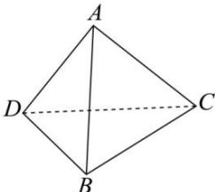

> [!faq]- 全练一本通解析
> **【答案】** $\frac{77\pi}{2}$
>
> **【解析】**
> 因为 $D_{1}D_{2}=12$ , $D_{1}D_{3}=10$ , $D_{2}D_{3}=8$ ,
> 由中位线性质可得 DB=4, CD=6, BC=5,
> 翻折后的四面体如图:
> 
> 由翻折的性质可得 AB=6, AC=4, AD=5,
> 所以四面体 ABCD 对棱相等,
> 故可以考虑将四面体 ABCD 补形为长方体
> 四面体 ABCD 的外接球即长方体的外接球,
> 设其外接球半径为 R，BM=x, BN=y, BP=z，
> 则 $\left(2R\right)^{2}=x^{2}+y^{2}+z^{2}$ ,
> 因为 $\left\{\begin{aligned}x^{2}+y^{2}&=36\\ x^{2}+z^{2}&=25\\ y^{2}+z^{2}&=16\end{aligned}\right.$ ，所以 $x^{2}+y^{2}+z^{2}=\frac{77}{2}$ 所以 $4R^{2}=\frac{77}{2}$ ,
> 所以四面体 ABCD 的外接球表面积 $S=4\pi R^{2}=\frac{77\pi}{2}$ ,
