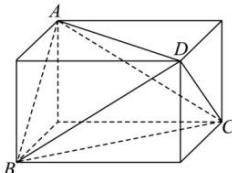

> [!faq]- 全练一本通解析
> **【答案】** $55\pi$
>
> **【解析】**
> 由题意，该三棱锥的对棱相等，可知该三棱锥可置于一个长方体中，如图所示：
> 
> 记该长方体的棱长为 a, b, c，则 $\left\{\begin{aligned}a^{2}+b^{2}&=5^{2}\\ a^{2}+c^{2}&=6^{2}\\ b^{2}+c^{2}&=7^{2}\end{aligned}\right.$ 即 $a^{2}+b^{2}+c^{2}=55$ ，所以外接球半径为 $r=\frac{\sqrt{a^{2}+b^{2}+c^{2}}}{2}=\frac{\sqrt{55}}{2}$ $S=4\pi r^{2}=55\pi$ .
> 故答案为： $55\pi$ .
