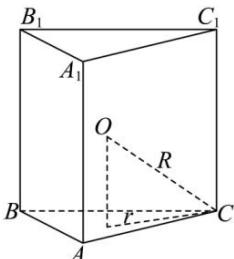
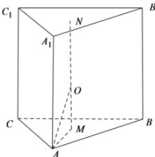

> [!faq]- 全练一本通解析
> **【答案】** 详见解析
>
> **【解析】**
> 
> 解析:由题意,设球的半径为 r ,底面三角形边长为 2x ,因为侧棱长与底面边长之比为 3:2,
> 所以侧棱长为 $3x$ ，因为三棱柱的侧面积为 162，
> 即满足 $3 \cdot (3x) \cdot (2x) = 18x^{2} = 162$ ，解得 x = 3，
> 可知侧棱长为9，底面边长为6，如图所示，
> 
> 设 $N, M$ 分别是上、下底面的中心， $MN$ 的中点 $O$ 是三棱柱 $ABC - A_1B_1C_1$ 外接球的球心，
> 则 $AM = \frac{\sqrt{3}}{3} \times 6 = 2\sqrt{3}$ ， $OM = \frac{1}{2} MN = \frac{1}{2} AA_1 = \frac{9}{2}$ ， $r = OA = \sqrt{OM^2 + AM^2} = \sqrt{\left(\frac{9}{2}\right)^2 + (2\sqrt{3})^2} = \frac{\sqrt{129}}{2}$ ，所以 $S = 4\pi r^2 = 4\pi \times \left(\frac{\sqrt{129}}{2}\right)^2 = 129\pi$ 。
