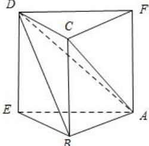

> [!faq]- 全练一本通解析
> **【答案】** $\frac{16\pi}{3}$ 或 $8\pi$
>
> **【解析】**
> 由题意可以将四面体 $ABCD$ 补成一个如图所示的直三棱柱，
> 
> 因为异面直线 $AB$ ， $CD$ 所成角为 $\frac{\pi}{3}$ ，所以 $\angle ABE = \frac{\pi}{3}$ 或 $\frac{2\pi}{3}$ 设 $\triangle ABE$ 的外接圆半径为 $r$ ，当 $\angle ABE = \frac{\pi}{3}$ 时， $\frac{1}{\sin 60^{\circ}} = 2r, r = \frac{\sqrt{3}}{3}$ 当 $\angle ABE = \frac{2\pi}{3}$ 时， $AE = \sqrt{3}$ ，则 $\frac{\sqrt{3}}{\sin 120^{\circ}} = 2r, r = 1$
> 设四面体的外接球半径为 R，则 $R=\sqrt{r^{2}+(\frac{BC}{2})^{2}}=\sqrt{r^{2}+1}$ ，
> 所以该四面体外接球的半径 $R=\frac{2\sqrt{3}}{3}$ 或 $\sqrt{2}$ ，则外接球的表面积为. $4\pi R^{2}=\frac{16\pi}{3}$ 或 $8\pi$ ，故答案为： $\frac{16\pi}{3}$ 或 $8\pi$
