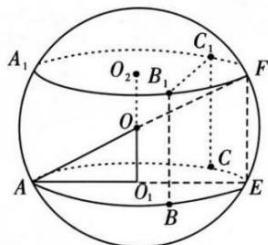
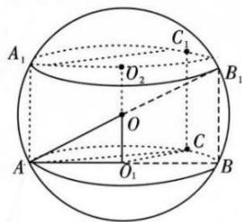
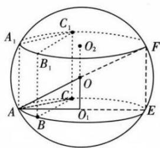

模型 3: 汉堡模型

适用范围:有一条侧棱垂直于底面的柱体

推导过程:如图,直三棱柱内接于球（同时直棱柱也内接于圆柱,棱柱的上下底面可以是任意三角形）.

第一步:确定球心 O 的位置, $O_{1}$ 是 ABC 的外心, 则 $OO_{1} \perp$ 平面 ABC.

第二步:算出小圆 $O_{1}$ 的半径 $AO_{1}=r, OO_{1}=\frac{1}{2}AA_{1}=\frac{1}{2}h(AA_{1}=h$ 也是圆柱的高）.

第三步: 勾股定理: $OA^{2}=O_{1}A^{2}+O_{1}O^{2}\Rightarrow R^{2}=\left(\frac{h}{2}\right)^{2}+r^{2}\Rightarrow R=\sqrt{r^{2}+\left(\frac{h}{2}\right)^{2}}$ ，求出 R.

![[高中/课堂同步/题库/高中数学全练一本通/立体几何初步/第十三节 专题-几何体的外接球与内切球问题/题型 1_ 求结合体的外接球/模型 3_ 汉堡模型/questions/Q00006249.md]]
![[高中/课堂同步/题库/高中数学全练一本通/立体几何初步/第十三节 专题-几何体的外接球与内切球问题/题型 1_ 求结合体的外接球/模型 3_ 汉堡模型/questions/Q00006250.md]]
![[高中/课堂同步/题库/高中数学全练一本通/立体几何初步/第十三节 专题-几何体的外接球与内切球问题/题型 1_ 求结合体的外接球/模型 3_ 汉堡模型/questions/Q00006251.md]]
![[高中/课堂同步/题库/高中数学全练一本通/立体几何初步/第十三节 专题-几何体的外接球与内切球问题/题型 1_ 求结合体的外接球/模型 3_ 汉堡模型/questions/Q00006252.md]]
