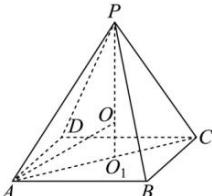

> [!faq]- 全练一本通解析
> **【答案】** $\frac{81\pi}{4}$
>
> **【解析】**
> 如图,正四棱锥 P-ABCD 的外接球的球心 O 在它的高 $PO_{1}$ 上,记外接球半径为 R ,
> 
> $PO = AO = R$ , $PO_{1} = 4$ , $OO_{1} = 4 - R$ , 底面正方形边长为 2,
> 在 Rt△AO₁O 中， $AO_{1}=\sqrt{2}$ ，可得 $R^{2}=2+(4-R)^{2}$ ，解得 $R=\frac{9}{4}$ ∴ 球的表面积 $S=4\pi\times\left(\frac{9}{4}\right)^{2}=\frac{81\pi}{4}$ 故答案为： $\frac{81\pi}{4}$
