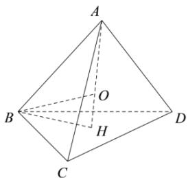

> [!faq]- 全练一本通解析
> **【答案】** $24\pi$
>
> **【解析】**
> 如图正四面体 ABCD 棱长为 4, $AH \perp$ 平面 BCD 于 H, 则 H 是 $\triangle BCD$ 中心, $BH = \frac{\sqrt{3}}{3} \times 4 = \frac{4\sqrt{3}}{3}$ ,
> AH⊥平面BCD，BH⊂平面BCD，则 $AH \perp BH$ ， $AH = \sqrt{4^{2} - \left(\frac{4\sqrt{3}}{3}\right)^{2}} = \frac{4\sqrt{6}}{3}$ 设外接球球心为 O，则 O 在 AH，则 OA = OB = R 为外接半径，
> 由 $BH^{2} + OH^{2} = BO^{2}$ 得 $\left(\frac{4\sqrt{3}}{3}\right)^{2} + \left(\frac{4\sqrt{6}}{3} - R\right)^{2} = R^{2}$ ，解得 $R = \sqrt{6}$ ，
> ∴ $S = 4\pi R^{2} = 24\pi$ . 故答案为： $24\pi$ .
> 
