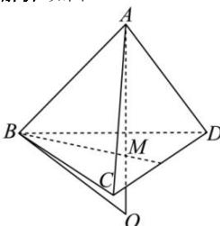

> [!faq]- 全练一本通解析
> **【答案】** 16π
>
> **【解析】**
> 如图:
> 
> 由题意知, 底面 $\triangle ABC$ 为等边三角形, 设 $M$ 为其中心,
> 则 $BM = \frac{\sqrt{3}}{3} \times 3 = \sqrt{3}$ ,
> 又 $AB = AC = AD = 2$ ,
> 所以该三棱锥为正三棱锥,
> 所以 $AM = \sqrt{AB^2 - BM^2} = 1$ ,
> 所以外接球半径 $R > AM$ ,
> 则外接球球心在 $AO$ 的延长线上,
> 所以 $OA = OB = R$ , 则 $OM = R - 1$ ,
> 所以在 Rt $\triangle BOM$ 中, $OB^2 = OM^2 + BM^2$ ,
> 即 $R^2 = (\sqrt{3})^2 + (R - 1)^2$ , 解得 $R = 2$ ,
> 所以外接球表面积为 $S = 4\pi R^2 = 16\pi$ . 故答案为: $16\pi$ .
