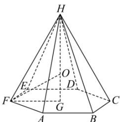
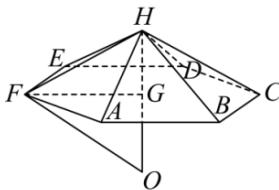

> [!faq]- 全练一本通解析
> **【答案】** $\frac{9\sqrt{3}}{2}$
>
> **【解析】**
> 设正六棱锥 $H - ABCDEF$ , 底面中心为 $G$ , 外接球半径为 $R$ , 底面正六边形的边长为 $a$ , 棱锥的高 $HG = h$ ,
> 则 $4\pi R^2 = 16\pi$ , $\therefore R = 2$ , $FG = a$ ,
> 当外接球的球心 $O$ 在棱锥内部时, $h > 2$ , 在 Rt $\triangle HGF$ 中, $FH^2 = HG^2 + FG^2$ , 即 $12 = h^2 + a^2$ , 在 Rt $\triangle OGF$ 中, $R^2 = OG^2 + FG^2$ ,
> 即 $4 = (h - 2)^2 + a^2$ , 联立 $\begin{cases} 12 = h^2 + a^2 \\ 4 = (h - 2)^2 + a^2 \end{cases}$ , 解得 $h = 3$ , $a = \sqrt{3}$ ,
> 所以正六棱锥 $H - ABCDEF$ 的体积为 $V = \frac{1}{3} \times 6 \times \frac{3\sqrt{3}}{4} \times 3 = \frac{9\sqrt{3}}{2}$ .
> 
> 当外接球的球心 $O$ 在棱锥外部时， $h < 2$ ，在 $\mathrm{Rt}\triangle HGF$ 中， $FH^2 = HG^2 + FG^2$ ，即 $12 = h^2 + a^2$ ，在 $\mathrm{Rt}\triangle OGF$ 中， $R^2 = OG^2 + FG^2$ 即 $4 = (2 - h)^2 + a^2$ ，联立 $\left\{ \begin{array}{l} 12 = h^2 + a^2 \\ 4 = (2 - h)^2 + a^2 \end{array} \right.$ ，解得 $h = 3$ ， $a = \sqrt{3}$ ，这与 $h < 2$ 矛盾，不合题意舍去.
> 
> 综上, 该正六棱锥的体积为 $V=\frac{9\sqrt{3}}{2}$ . 故答案为: $\frac{9\sqrt{3}}{2}$ .
