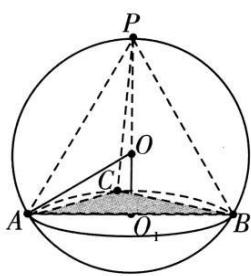
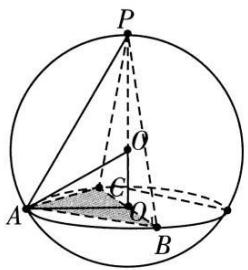
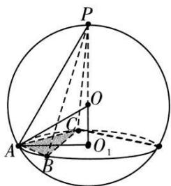
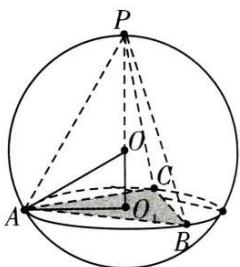

## 模型 4: 斗笠模型

使用范围: 正棱锥或顶点的投影在底面的外心上的棱锥

推导过程:取底面的外心 $O_{1}$ ，连接顶点与外心,该线为空间几何体的高h，在h上取一点作为球心O，根据勾股定理 $R^{2}=(h-R)^{2}+r^{2}\Leftrightarrow R=\frac{r^{2}+h^{2}}{2h}$

![[高中/课堂同步/题库/高中数学全练一本通/立体几何初步/第十三节 专题-几何体的外接球与内切球问题/题型 1_ 求结合体的外接球/模型 4_ 斗笠模型/questions/Q00006253.md]]
![[高中/课堂同步/题库/高中数学全练一本通/立体几何初步/第十三节 专题-几何体的外接球与内切球问题/题型 1_ 求结合体的外接球/模型 4_ 斗笠模型/questions/Q00006254.md]]
![[高中/课堂同步/题库/高中数学全练一本通/立体几何初步/第十三节 专题-几何体的外接球与内切球问题/题型 1_ 求结合体的外接球/模型 4_ 斗笠模型/questions/Q00006255.md]]
![[高中/课堂同步/题库/高中数学全练一本通/立体几何初步/第十三节 专题-几何体的外接球与内切球问题/题型 1_ 求结合体的外接球/模型 4_ 斗笠模型/questions/Q00006256.md]]
![[高中/课堂同步/题库/高中数学全练一本通/立体几何初步/第十三节 专题-几何体的外接球与内切球问题/题型 1_ 求结合体的外接球/模型 4_ 斗笠模型/questions/Q00006257.md]]
![[高中/课堂同步/题库/高中数学全练一本通/立体几何初步/第十三节 专题-几何体的外接球与内切球问题/题型 1_ 求结合体的外接球/模型 4_ 斗笠模型/questions/Q00006258.md]]
