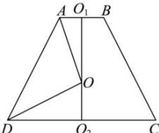

> [!faq]- 全练一本通解析
> **【答案】** $\frac{500\pi}{3}cm^{3}$
>
> **【解析】**
> 如图,圆台的轴截面为等腰梯形 ABCD,
> 其中 $O_{1}$ ， $O_{2}$ 分别是圆台上、下底面圆的圆心，
> O 是圆台外接球的球心，则 AB = 6cm，CD = 8cm，
> 
> $O_{1}O_{2}=7cm$ ，设 $OO_{1}=xcm$ ，
> 则 $3^{2} + x^{2} = 4^{2} + (7 - x)^{2}$ ，解得 $x = 4$
> 则该圆台外接球的半径 $R = \sqrt{3^2 + x^2} = 5\mathrm{cm}$ ，体积 $V = \frac{4\pi}{3} R^3 = \frac{500\pi}{3}\mathrm{cm}^3$ 故答案为： $\frac{500\pi}{3}\mathrm{cm}^3$
