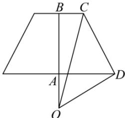
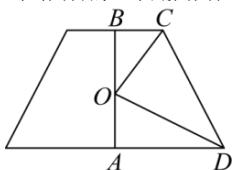

> [!faq]- 全练一本通解析
> **【答案】** $\frac{20\sqrt{5}}{3}\pi$
>
> **【解析】**
> 设圆台高为 h, 由题意得 $\frac{1}{2}(2+4)h=3$ , h=1.
> 当圆台的上下底面圆在球心的同侧时, 如下图所示:
> 
> 设该圆台下底面圆心到外接球的球心的距离为 $AO = h_0$ ， $AB = h = 1$ 外接球的半径为 $R$ ，由 $OC = OD = R$ 则 $\left(1 + h_0\right)^2 +1^2 = h_0^2 +2^2 = R^2$ ，得 $h_0 = 1$ ， $R^2 = 5$ ，该圆台外接球的体积为 $\frac{4}{3}\pi R^3 = \frac{20\sqrt{5}}{3}\pi .$
> 当当圆台的上下底面圆在球心的异侧时,如下图所示:
> 
> 设该圆台下底面圆心到外接球的球心的距离为 $AO = h_{0}$ ，AB = h = 1，
> 外接球的半径为 R，由 OC = OD = R，
> 则 $\left(1-h_{0}\right)^{2}+1^{2}=h_{0}^{2}+2^{2}=R^{2}$ ，得 $h_{0}=-1$ 舍去，
> 综上所述:该圆台外接球的体积为 $\frac{20\sqrt{5}}{3}\pi$ ，故答案为： $\frac{20\sqrt{5}}{3}\pi$
