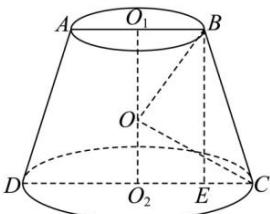

> [!faq]- 全练一本通解析
> **【答案】** $\frac{500\pi}{3}$
>
> **【解析】**
> 由题意可设圆台 $O_{1}O_{2}$ 的高为 h，上、下底面半径分别为 r,2r，
> 球 O 的半径为 R，因为 $OO_{1}=2OO_{2}$ 所以 $OO_{1}=\frac{2h}{3}, OO_{2}=\frac{h}{3}$ 所以 $r^{2}+\left(\frac{2}{3}h\right)^{2}=(2r)^{2}+\left(\frac{1}{3}h\right)^{2}=R^{2}$ 得 $h=3r, R=\sqrt{5}r$ 则 $BC=\sqrt{h^{2}+(2r-r)^{2}}=\sqrt{10}r=5\sqrt{2}$ 所以 $r=\sqrt{5}$ ，R=5，
> 所以球 O 的体积为 $\frac{4}{3}\pi R^{3}=\frac{4}{3}\pi\times5^{3}=\frac{500\pi}{3}$
> 
> 故答案为: $\frac{500\pi}{3}$ .
