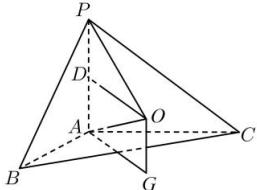

> [!faq]- 全练一本通解析
> **【答案】** C
>
> **【解析】**
> 解析:根据题意设底面 $\triangle ABC$ 的外心为 G, O 为球心, 所以 $OG \perp$ 平面 ABC, 因为 $PA \perp$ 平面 ABC,
> 所以 $OG // PA$ ，设 D 是 PA 中点，因为 OP = OA，所以 $DO \perp PA$ ，
> 因为 $PA \perp$ 平面 ABC， $AG \subset$ 平面 ABC，所以 $AG \perp PA$ ，因此 $OD // AG$ 因此四边形 ODAG 是平行四边形, 故 $OG = AD = \frac{1}{2} PA = 1$ ,
> 由余弦定理, 得 $BC=\sqrt{AB^{2}+AC^{2}-2AB\cdot AC\cdot\cos120^{\circ}}=\sqrt{4+4-2\times2\times2\times(-\frac{1}{2})}=2\sqrt{3}$ 由正弦定理, 得 $2AG=\frac{2\sqrt{3}}{\frac{\sqrt{3}}{2}}\Rightarrow AG=2$ ，所以该外接球的半径 R 满足 $R^{2}=(OG)^{2}+(AG)^{2}=5\Rightarrow S=4\pi R^{2}=20\pi$ , 故选:C.
> 
