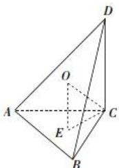

> [!faq]- 全练一本通解析
> **【答案】** C
>
> **【解析】**
> 解析：
> 
> $\because CD \perp$ 平面 $ABC, AC \subset$ 平面 $ABC, \therefore CD \perp AC,$ 又 $\triangle ACD$ 是等腰三角形， $\therefore CD = AC.$ $\because \triangle ABC$ 是正三角形， $\therefore AB = BC = AC = CD = 2\sqrt{3}$ . 设 $E$ 为 $\triangle ABC$ 外接圆的圆心，则 $CE = 2\sqrt{3} \times \frac{\sqrt{3}}{2} \times \frac{2}{3} = 2, OE = \frac{1}{2} CD = \sqrt{3},$ $\therefore OC = \sqrt{OE^2 + CE^2} = \sqrt{7}, \therefore$ 球 $O$ 的体积 $V = \frac{4}{3}\pi \times (\sqrt{7})^3 = \frac{28\sqrt{7}}{3}\pi.$
>
> 故选 **C**.
