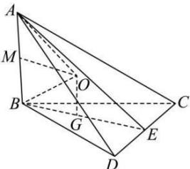

> [!faq]- 全练一本通解析
> **【答案】** C
>
> **【解析】**
> 解析:取AB的中点M，CD中点为E，连接BE，
> 设 $\triangle BCD$ 的中心为G，作OG//AB，且OG= $\frac{1}{2}$ AB=MA=MB，
> 由于BG=CG=DG，OG⊥平面BCD，
> 所以四边形MOGB为矩形，故 $BO=CO=DO=\sqrt{BG^{2}+OG^{2}}=\sqrt{MO^{2}+AM^{2}}=OA$ 则O为外接球的球心， $\because BG=\frac{1}{2}\frac{BC}{\sin\frac{\pi}{3}}=\sqrt{3}$ ，∴外接球的半径 $R=\sqrt{BG^{2}+\left(\frac{1}{2}AB\right)^{2}}=\sqrt{3+1}=2$ ，
> ∴四面体ABCD外接球的表面积为 $4\pi R^{2}=16\pi$ .
> 故选:C.
> 
