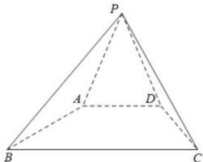

<!-- question-source:start -->
【40】如图, 在四棱锥 P-ABCD 中, 平面 PAD⊥平面 ABCD, $\triangle PAD$ 是边长为 4 的等边三角形, 四边形 ABCD 是等腰梯形, $AB = AD = \frac{1}{2} BC$ , 则四棱锥 P-ABCD 外接球的表面积是 \_\_\_\_.

<!-- question-source:end -->

![[Q00006276A1]]
