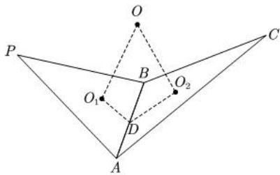

<!-- question-source:start -->
【42】(2024·四川泸州二模)已知三棱锥 S-ABC 的底面是边长为 3 的等边三角形, 且满足 $\angle SAB = 120^{\circ}$ , SA = AB, 当该三棱锥的体积取得最大值时, 其外接球的表面积为（）

A. $12\pi$ B. $24\pi$ C. $36\pi$ D. $39\pi$

如图为四面体 P-ABC，已知二面角 P-AB-C 的大小为 $\theta$ ，其外接球问题的步骤如下：

（1）找出 $\triangle PAB$ 和 $\triangle ABC$ 的外接圆圆心，分别记为 $O_{1}$ 和 $O_{2}$

（2）分别过 $O_{1}$ 和 $O_{2}$ 作平面 $PAB$ 和平面 $ABC$ 的垂线，其交点为球心，记为 $O$ ：

（3）过 $O_{1}$ 作AB的垂线，垂足记为D，连接 $O_{2}D$ ，则 $O_{2}D\perp AB$ .

（4）在四棱锥 $A-DO_{1}OO_{2}$ 中，AD 垂直于平面 $DO_{1}OO_{2}$ ，底面四边形 $DO_{1}OO_{2}$ 的四个顶点共圆且 OD 为该圆的直径.

(5)秒杀公式: $R^2 = \frac{m^2 + n^2 - 2mn\cos\theta}{\sin^2\theta} + \frac{l^2}{4}$ (任选两个三角形面, $m, n$ 分别为外接圆圆心到交线的距离, $\theta$ 为这两个平面的夹角, $l$ 为这两个平面的交线长度)
<!-- question-source:end -->

![[Q00006278A1]]
