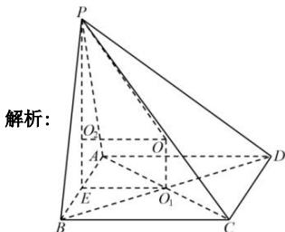

> [!faq]- 全练一本通解析
> **【答案】** 详见解析
>
> **【解析】**
> $28\sqrt{21}\pi$
> 
> 设正方形 $ABCD$ 的边长为 $2x$ ，在等边三角形 $PAB$ 中，过 $P$ 点作 $PE \perp AB$ 于 $E$ ，
> 由于平面 $PAB \perp$ 平面 $ABCD$ ， $\therefore PE \perp$ 平面 $ABCD$ 。
> 由于 $\triangle PAB$ 是等边三角形，则 $PE = \sqrt{3} x$ ， $\therefore V_{P-ABCD} = \frac{1}{3} \cdot S_{ABCD} \cdot PE = \frac{1}{3} \times (2x)^2 \times \sqrt{3} x = 36\sqrt{3}$ ，解得 $x = 3$ 。
> 设四棱锥外接球的半径为 $R$ ， $O_1$ 为正方形 $ABCD$ 中心， $O_2$ 为等边三角形 $PAB$ 中心， $O$ 为四棱锥 $P-ABCD$ 外接球球心，则易知 $OO_2EO_1$ 为矩形，
> 则 $OO_2 = EO_1 = \frac{1}{2} AD = x = 3$ ， $PO_2 = \frac{2}{3} PE = \frac{2}{3} \cdot 3\sqrt{3} = 2\sqrt{3}$ ， $R = OP = \sqrt{OO_2^2 + PO_2^2} = \sqrt{9 + 12} = \sqrt{21}$ ， $\therefore$ 外接球体积 $V = \frac{4}{3}\pi \times (\sqrt{21})^3 = 28\sqrt{21}\pi$ 。
> 故答案为： $28\sqrt{21}\pi$ .
