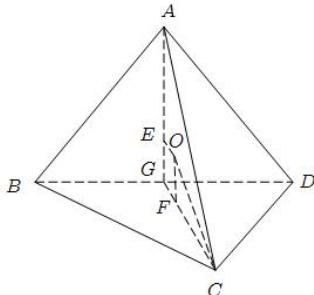

> [!faq]- 全练一本通解析
> **【答案】** $\frac{20\sqrt{5}}{3}\pi$
>
> **【解析】**
> 依题意,平面 $ABD \perp$ 平面 $BCD, \triangle BCD$ 和 $\triangle ABD$ 均是边长为 $2\sqrt{3}$ 的正三角形,
> 设 G 是 BD 的中点, 则 $AG \perp BD, CG \perp BD$ ,
> 由于平面 $ABD \perp$ 平面 BCD 且交线为 BD，
> 所以 $AG \perp$ 平面 BCD， $CG \perp$ 平面 ABD.
> 设 E, F 分别是等边三角形 ABD 和等边三角形 BCD 的中心，
> 则 AE = CF = 2GE = 2GF = $\frac{2}{3}CG = \frac{2}{3} \times 3 = 2$ 设 O 是三棱锥 A-BCD 外接球的球心，
> 则 OE⊥平面 ABD，OF⊥平面 BCD.
> 所以外接球的半径 $R=\sqrt{OF^{2}+CF^{2}}=\sqrt{1^{2}+2^{2}}=\sqrt{5}$ 所以外接球的体积为 $\frac{4\pi}{3}\times\left(\sqrt{5}\right)^{3}=\frac{20\sqrt{5}}{3}\pi$ . 故选： $\frac{20\sqrt{5}}{3}\pi$
> 
