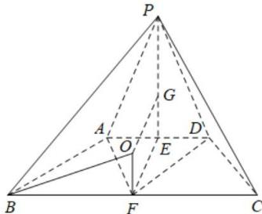

> [!faq]- 全练一本通解析
> **【答案】** $\frac{208\pi}{3}$
>
> **【解析】**
> 如图,取 AD 的中点 E, BC 的中点 F, 连 EF, PE, 在 PE 上取点 G, 使得 PG = 2GE,
> 由 $\triangle PAD$ 是边长为 4 的等边三角形, 四边形 ABCD 是等腰梯形, $AB = AD = \frac{1}{2}BC$ ,
> 可得，AB = AF = BF = CF = FD = 4，即梯形 ABCD 的外接圆圆心为 F，
> 分别过点 G、F 作平面 PAD、平面 ABCD 的垂线,两垂线相交于点 O，
> 显然点 O 为四棱锥 P-ABCD 外接球的球心，
> 
> 由题可得 $PE = 2\sqrt{3}$ ， $GE = OF = \frac{2\sqrt{3}}{3}$ ，
> 则四棱锥 P-ABCD 外接球的半径 $R^{2}=OB^{2}=\left(\frac{2\sqrt{3}}{3}\right)^{2}+4^{2}=\frac{52}{3}$ ，
> 故四棱锥 P-ABCD 外接球的表面积为 $4\pi \times R^{2} = 4\pi \times \frac{52}{3} = \frac{208\pi}{3}$ .
> 故答案为： $\frac{208\pi}{3}$ .
