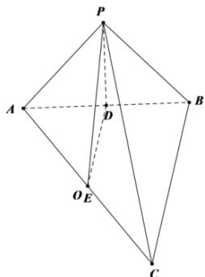

> [!faq]- 全练一本通解析
> **【答案】** 4
>
> **【解析】**
> 因为 $BC = 4\sqrt{2}$ ，AC = 8， $AB \perp BC$ ，
> 所以 $AB = 4\sqrt{2}$ ，又因为 PA = PB = 4，
> 所以 $PA^{2} + PB^{2} = AB^{2}$ ，所以 $PA \perp PB$ ，
> 因为平面 $PAB \perp$ 平面 ABC，平面 $PAB \cap$ 平面
> ABC = AB, $AB \perp BC$ , BC ⊂ 平面 ABC,
> 所以 BC⊥平面 PAB,
> 取 AB, AC 中点 D, E, 连接 DE, DP
> 所以 DE // BC, DE = $2\sqrt{2}$ , DP = $2\sqrt{2}$ 所以 DE⊥平面 PAB, 所以 DE⊥PD,
> 此时， $EB=\frac{1}{2}AC=EA=EC=4,\quad EP=\sqrt{DP^{2}+DE^{2}}=4$ 所以 EA=EB=EC=EP=4，
> 即球 O 的球心球心 O 即为 E （O 与 E 重合），半径为 EA=4.
> 故答案为: 4.
> 
