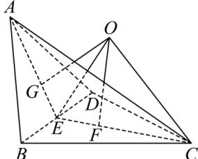

> [!faq]- 全练一本通解析
> **【答案】** $\frac{28\pi}{3}$
>
> **【解析】**
> 将 $\triangle ABD$ 沿 BD 折起后, 取 BD 中点为 E, 连接 AE, CE,
> 则 $AE \perp BD, CE \perp BD$ ,
> 可知 $\angle AEC$ 即为二面角 A-BD-C 的平面角, 即 $\angle AEC = 120^{\circ}$ ;
> 设 AE = a , 则 AE = CE = a ,
> 在 $\triangle AEC$ 中, 由余弦定理可得: $AC^{2} = AE^{2} + EC^{2} - 2AE \cdot CE \cdot \cos 120^{\circ}$ ,
> 即 $9 = a^{2} + a^{2} - 2 \times a \times a \times \left(-\frac{1}{2}\right)$ 解得 $a = \sqrt{3}$ ,
> 即 $AE = \sqrt{3}$ ，可得 $AB = \sqrt{1 + 3} = 2$ 所以 $\triangle ABD$ 与 $\triangle BCD$ 是边长为 2 的等边三角形，
> 分别记三角形 $\triangle ABD$ 与 $\triangle BCD$ 的重心为 G、F，
> 则 $EG = EF = \frac{1}{3} AE = \frac{\sqrt{3}}{3}, CF = \frac{2}{3} CE = \frac{2\sqrt{3}}{3}; EF = EG;$ 因为 $\triangle ABD$ 与 $\triangle BCD$ 都是边长为 2 的等边三角形，
> 所以点 G 是 $\triangle ABD$ 的外心，点 F 是 $\triangle BCD$ 的外心；
> 记该几何体 ABCD 的外接球球心为 O，连接 OF，OG，
> 
> 根据球的性质, 可得 $OF \perp$ 平面 BCD, $OG \perp$ 平面 ABD, 所以 $\triangle OGE$ 与 $\triangle OFE$ 都是直角三角形, 且 OE 为公共边,所以 Rt△OGE 与 Rt△OFE 全等, 因此 $\angle OEG = \angle OEF = \frac{1}{2} \angle AEC = 60^{\circ}$ 所以 $OF = EF \tan 60^{\circ} = 1$ ;
> 因为 $AE \perp BD$ , $CE \perp BD$ , $AE \cap CE = E$ , $AE, CE \subset$ 平面 AEC,
> 所以 BD⊥平面 AEC;
> 又 OE⊂平面 AEC，所以 BD⊥OE，
> 连接 OC，则外接球半径为 $OC^{2}=OF^{2}+CF^{2}=\frac{7}{3}$ 所以外接球表面积为 $S=4\pi\times\frac{7}{3}=\frac{28\pi}{3}$ . 故答案为: $\frac{28\pi}{3}$ .
