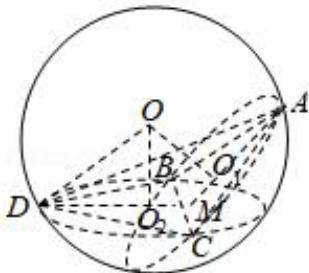

> [!faq]- 全练一本通解析
> **【答案】** B
>
> **【解析】**
> 解析: 如图, 取 BC 的中点为 M,
> 设球心 O 在平面 ABC 内的射影为 $0_{1}$ ,
> 在平面 BCD 内的射影为 $O_{2}$ ,
> 则二面角 A-BC-D 的平面角为 $\angle AMD$ , $AB = \sqrt{3}$ ,
> 所以 $DM = \frac{3}{2}$ , $DO_{2} = 1$ , $O_{2}M = \frac{1}{2}$ ,
> 设 $\angle AMD = 2\theta$ ，则 $\cos 2\theta = 2\cos^{2}\theta - 1 = -\frac{1}{3}$ ，解得 $\tan\theta = \sqrt{2}$ ,
> ∴ $OO_{2}=O_{2}M\tan\theta=\frac{\sqrt{2}}{2}$ ，球 O 的半径 $R=\sqrt{DO_{2}^{2}+OO_{2}^{2}}=\frac{\sqrt{6}}{2}$ 所求外接球的体积为 $V=\frac{4}{3}\pi(\frac{\sqrt{6}}{2})^{2}=\sqrt{6}\pi$ ，故选：B.
> 
