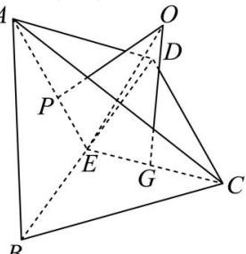

> [!faq]- 全练一本通解析
> **【答案】** C
>
> **【解析】**
> 解析:由题意如图所示:设 E 为 BD 的中点,连接 AE,CE, 设 P,G 分别为 $\triangle ABD$ , $\triangle BCD$ 的外接圆的圆心,
> 过 P, G 分别作两个半平面的垂线, 交于 O, 则可得 O 为该三棱锥的外接球的球心,
> 连接 OC, OE, 则 OC 为外接球的半径,
> 
> 由 $\triangle ABD$ 与 $\triangle BCD$ 均为边长为2的等边三角形，则 $AE = CE = \frac{\sqrt{3}}{2}\times 2 = \sqrt{3}$ 又 $AC = 3$ ，则由余弦定理可得 $\cos \angle AEC = \frac{AE^2 + CE^2 - AC^2}{2AE\cdot CE} = \frac{3 + 3 - 9}{2\times\sqrt{3}\times\sqrt{3}} = -\frac{1}{2}$ ，所以 $\angle AEC = 120^{\circ}$ ，，因为 $P,G$ 分别为 $\triangle ABD$ ， $\triangle BCD$ 的外接圆的圆心，所以 $CG = \frac{2}{3} CE = \frac{2\sqrt{3}}{3},EG = \frac{1}{3} CE = \frac{\sqrt{3}}{3},$ 可得 $\triangle OPE\cong \triangle OGE$ ，可得 $\angle OEC = 60^{\circ}$ ，而 $\angle OGE = 90^{\circ}$ ，所以 $OG = \sqrt{3} EG = 1,$ 在 $\triangle OGC$ 中： $R^2 = OC^2 = OG^2 +CG^2 = 1^2 +(\frac{2\sqrt{3}}{3})^2 = \frac{7}{3},$ 所以外接球的表面积 $S = 4\pi R^2 = \frac{28\pi}{3}$
>
> 故选 **C**.
