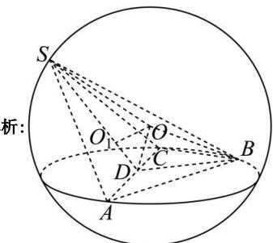

> [!faq]- 全练一本通解析
> **【答案】** C
>
> **【解析】**
> 
> 如图, 因为 $AB \perp BC$ , AB = BC = 2, 所以 $AC = 2\sqrt{2}$ ,
> 因为 $SA = SC = 2\sqrt{2}$ ，所以 $\triangle SAC$ 为等边三角形，所以 $SD=\frac{\sqrt{3}}{2}SA=\frac{\sqrt{3}}{2}\times2\sqrt{2}=\sqrt{6}$ .
> 取 AC 的中点 D，连接 BD 和 SD，则 $\angle SDB$ 为二面角 B-AC-S 的平面角，即 $\angle SDB = 150^{\circ}$ .
> 因为 $\triangle ABC$ 为直角三角形，所以 D 为 $\triangle ABC$ 的外心。设 $\triangle SAC$ 的外心为 $Q_{1}$ 过点 D 作平面 ABC 的垂线，过点 $Q_{1}$ 作平面 SAC 的垂线，则交点 O 为球心，连接 OD, OS. 设三棱锥 S-ABC 外接球的半径为 R.
> 在 Rt $\triangle ODB$ 中， $OD^{2}=OB^{2}-BD^{2}=R^{2}-\left(\sqrt{2}\right)^{2}=R^{2}-2$ 由已知得 $\angle SDO = 60^{\circ}$ ，在 $\triangle SDO$ 中，由余弦定理得 $SO^{2}=OD^{2}+SD^{2}-2OD\cdot SD\cdot\cos\angle SDO$ 即 $R^{2}=R^{2}-2+\left(\sqrt{6}\right)^{2}-2\sqrt{R^{2}-2}\times\sqrt{6}\times\cos60^{\circ}$ ，解得 $R^{2}=\frac{14}{3}$ ，
> 故三棱锥 S-ABC 外接球的表面积为 $S=4\pi R^{2}=\frac{56\pi}{3}$ .
>
> 故选 **C**.
