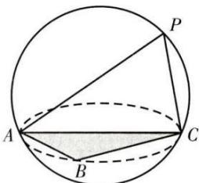
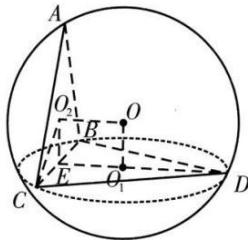

模型 7: 切瓜模型（面面垂直）

使用范围:有两个平面互相垂直的棱锥

推导过程: 分别在两个互相垂直的平面上取外心 $O_{1}$ 、 $O_{2}$ 过两个外心做两个垂面的垂线，两条垂线的交点即为球心 O ，取 BC 的中点为 E ，连接 $OO_{1}$ 、 $OO_{2}$ 、 $O_{2}E$ 、 $O_{1}E$ 为矩形

由勾股可得 $|OC|^{2} = |O_{2}C|^{2} + |OO_{2}|^{2} = |O_{2}C|^{2} + |O_{1}C|^{2} - |CE|^{2} \therefore R^{2} = r_{1}^{2} + r_{2}^{2} - \frac{l^{2}}{4}$

![[高中/课堂同步/题库/高中数学全练一本通/立体几何初步/第十三节 专题-几何体的外接球与内切球问题/题型 1_ 求结合体的外接球/模型 7_ 切瓜模型（面面垂直）/questions/Q00006273.md]]
![[高中/课堂同步/题库/高中数学全练一本通/立体几何初步/第十三节 专题-几何体的外接球与内切球问题/题型 1_ 求结合体的外接球/模型 7_ 切瓜模型（面面垂直）/questions/Q00006274.md]]
![[高中/课堂同步/题库/高中数学全练一本通/立体几何初步/第十三节 专题-几何体的外接球与内切球问题/题型 1_ 求结合体的外接球/模型 7_ 切瓜模型（面面垂直）/questions/Q00006275.md]]
![[高中/课堂同步/题库/高中数学全练一本通/立体几何初步/第十三节 专题-几何体的外接球与内切球问题/题型 1_ 求结合体的外接球/模型 7_ 切瓜模型（面面垂直）/questions/Q00006276.md]]
![[高中/课堂同步/题库/高中数学全练一本通/立体几何初步/第十三节 专题-几何体的外接球与内切球问题/题型 1_ 求结合体的外接球/模型 7_ 切瓜模型（面面垂直）/questions/Q00006277.md]]
![[高中/课堂同步/题库/高中数学全练一本通/立体几何初步/第十三节 专题-几何体的外接球与内切球问题/题型 1_ 求结合体的外接球/模型 7_ 切瓜模型（面面垂直）/questions/Q00006278.md]]
![[高中/课堂同步/题库/高中数学全练一本通/立体几何初步/第十三节 专题-几何体的外接球与内切球问题/题型 1_ 求结合体的外接球/模型 7_ 切瓜模型（面面垂直）/questions/Q00006279.md]]
![[高中/课堂同步/题库/高中数学全练一本通/立体几何初步/第十三节 专题-几何体的外接球与内切球问题/题型 1_ 求结合体的外接球/模型 7_ 切瓜模型（面面垂直）/questions/Q00006280.md]]
![[高中/课堂同步/题库/高中数学全练一本通/立体几何初步/第十三节 专题-几何体的外接球与内切球问题/题型 1_ 求结合体的外接球/模型 7_ 切瓜模型（面面垂直）/questions/Q00006281.md]]
![[高中/课堂同步/题库/高中数学全练一本通/立体几何初步/第十三节 专题-几何体的外接球与内切球问题/题型 1_ 求结合体的外接球/模型 7_ 切瓜模型（面面垂直）/questions/Q00006282.md]]
![[高中/课堂同步/题库/高中数学全练一本通/立体几何初步/第十三节 专题-几何体的外接球与内切球问题/题型 1_ 求结合体的外接球/模型 7_ 切瓜模型（面面垂直）/questions/Q00006283.md]]
