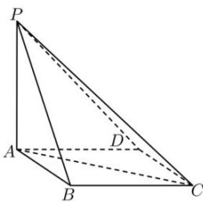

<!-- question-source:start -->
【51】《九章算术》中, 将底面为矩形且有一条侧棱与底面垂直的四棱锥称为阳马, 将四个面均为直角三角形的四面体称为鳖臑. 如图, 四棱锥 P-ABCD 中, $PA \perp$ 底面 ABCD, 四边形 ABCD 为矩形, PA = AD = AB, 则四棱锥 P-ABCD 和三棱锥 P-ADC 的内切球半径比为 \_\_\_\_.

<!-- question-source:end -->

![[Q00006287A1]]
