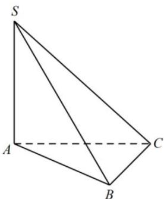

> [!faq]- 全练一本通解析
> **【答案】** A
>
> **【解析】**
> 解析: 因为 $SA \perp$ 平面 $ABC, \angle ABC = 90^{\circ}$ ， $AB \subset$ 平面 ABC， $AC \subset$ 平面 ABC， $BC \subset$ 平面 ABC，
> 所以 $SA \perp AB$ ， $SA \perp AC$ ， $SA \perp BC$ ，
> 又 $BC \perp AB, SA \cap AB = A$ 所以 $BC \perp$ 平面 SAB，所以 $BC \perp SB$ 所以 $\triangle SAB, \triangle ABC, \triangle SAC, \triangle SBC$ 均为直角三角形，
> 设球 O 的半径为 r，则 $V_{S-ABC}=\frac{1}{3}\left(S_{\triangle SAB}+S_{\triangle CAB}+S_{\triangle SAC}+S_{\triangle SBC}\right)\cdot r$ 而 $V_{S-ABC}=\frac{1}{3}\times3\times\frac{1}{2}\times3\times4=6$ , $S_{\triangle SAB}=S_{\triangle CAB}=\frac{1}{2}SA\cdot AB=6,S_{\triangle SAC}=S_{\triangle SBC}=\frac{1}{2}\times3\times5=\frac{15}{2}$ 所以 $\frac{1}{3}\left(6+6+\frac{15}{2}+\frac{15}{2}\right)\cdot r=6$ ，解得 $r=\frac{2}{3}$ ，
> 所以球 O 的表面积为 $S=4\pi r^{2}=4\pi\times\left(\frac{2}{3}\right)^{2}=\frac{16\pi}{9}$ ，故选：A.
> 
> 【4】B
